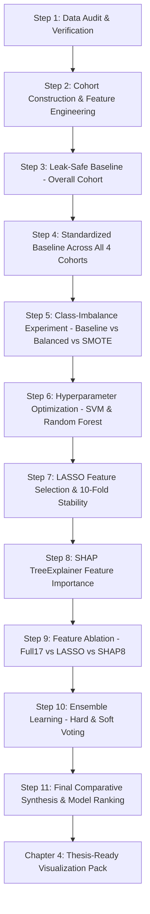

# Comprehensive Project Analysis: AI-Induced Career Anxiety Prediction

**Project Title:** AI-Induced Career Anxiety Prediction Among University Students  
**Nature of Project:** Undergraduate Final Year Research Project & Interactive Demonstration Prototype  
**Primary Source Files:**
1. `Career_Anxiety_due_to_AI.xlsx` (Empirical Survey Dataset: 3,156 records, 15 columns)
2. `final_all(1).ipynb` (Master Comparative Research Notebook: Steps 1 through 11 + Chapter 4 Visualization Pack)

---

## 1. Executive Summary

This document provides a complete, grounded analysis of the machine learning research pipeline developed in `final_all(1).ipynb` and the empirical survey data in `Career_Anxiety_due_to_AI.xlsx`. 

The research investigates the psychological and career impacts of generative and transformative Artificial Intelligence on university students in Bangladesh across diverse academic tiers (Public vs. Private institutions). The analytical methodology adheres strictly to a leak-safe, reproducible machine learning protocol:
- Stratified 80/20 train-test splitting
- 10-fold stratified cross-validation executed strictly on training folds
- Class-imbalance mitigation (comparing baseline, class weighting, and SMOTE)
- Controlled hyperparameter optimization
- LASSO (L1) 10-fold stability analysis
- SHAP TreeExplainer feature importance
- Feature ablation across 3 feature configurations (Full 17, LASSO stable subset, SHAP top-8)
- Ensemble modeling (Hard and Soft Voting across performance-focused and diversity-focused architectures)
- Four comparative cohorts: **Overall**, **Public**, **Private**, and **Daffodil International University**

---

## 2. Dataset Structure & Data Audit

### 2.1 Raw Dataset Inventory (`Career_Anxiety_due_to_AI.xlsx`)
- **Total Raw Records:** 3,156 responses
- **Total Raw Columns:** 15 columns
- **Survey Completeness:** Consent verified for 100% of participants (`consent == 'Yes'`)

| # | Column Name | Raw Data Type | Missing Count | Observed Categories / Value Space |
|---|---|---|---|---|
| 1 | `participant_id` | String / Object | 0 | Unique IDs `P0001` through `P3156` |
| 2 | `university` | String / Object | 0 | 5 Universities (3 Public, 2 Private) |
| 3 | `department` | String / Object | 0 | 23 Academic Departments |
| 4 | `age` | Integer | 0 | 18 to 27 years |
| 5 | `gender` | String / Object | 0 | `Male`, `Female` |
| 6 | `academic_year` | String / Object | 0 | `1st Year`, `2nd Year`, `3rd Year`, `4th Year` |
| 7 | `ai_knowledge` | String / Object | 45 | `None`, `Low`, `Medium`, `High` (45 nulls handled via median imputer) |
| 8 | `ai_tools_used` | String / Object | 0 | Multi-select comma-separated text of AI tools |
| 9 | `career_path` | String / Object | 0 | 160 distinct target career paths / aspirations |
| 10 | `ai_tool_perception` | String / Object | 91 | Open text / tool perceptions (91 nulls; indicates threat perception) |
| 11 | `ai_future_perspective`| String / Object | 0 | 5-level ordinal Likert statement on AI future job displacement |
| 12 | `ai_replace_jobs` | String / Object | 0 | `No`, `Partially`, `Fully` |
| 13 | `ai_takeover_time` | String / Object | 0 | `Never`, `50+ years`, `21–50 years`, `11–20 years`, `6–10 years`, `1–5 years` |
| 14 | `career_anxiety` | String / Object | 0 | Survey target: `No Anxiety`, `Low`, `Medium`, `High` |
| 15 | `consent` | String / Object | 0 | `Yes` (all rows) |

### 2.2 Analytical Cohort Filtering Rule
The research protocol establishes that **1st-year students are excluded** because early-stage students have not yet encountered core career preparation, internship pressures, or specialization choices.

- **1st Year Records Excluded:** 1,120 rows
- **Analytical Sample (2nd, 3rd, 4th Year):** **2,036 rows**

```
Total Survey Rows: 3,156
  ├── 1st Year (Excluded) : 1,120 (35.49%)
  └── Analytical Population: 2,036 (64.51%)
        ├── 2nd Year:   985 (48.38%)
        ├── 3rd Year:   762 (37.43%)
        └── 4th Year:   289 (14.19%)
```

---

## 3. Target Definition & Class Distribution

The target variable originates from the survey question `career_anxiety`, captured on a 4-level scale. In alignment with psychiatric and clinical screening standards (e.g., GAD-7 binarization thresholds), the research binarizes anxiety into **Low/None** vs **Elevated (Medium/High)** anxiety.

### 3.1 Binarization Mapping
$$\text{Anxiety\_Label} = \begin{cases} 0 & \text{if } \text{career\_anxiety} \in \{\text{"No Anxiety"}, \text{"Low"}\} \\ 1 & \text{if } \text{career\_anxiety} \in \{\text{"Medium"}, \text{"High"}\} \end{cases}$$

### 3.2 Target Distribution Across Analytical Population
| Class Label | Semantic Meaning | Count (N=2,036) | Percentage |
|---|---|---|---|
| **Class 0** | Negative (No Anxiety or Low Anxiety) | 660 | 32.42% |
| **Class 1** | Positive (Medium or High Career Anxiety) | 1,376 | 67.58% |

> [!NOTE]
> The target demonstrates a mild natural imbalance of approximately **1 : 2.08** (with elevated anxiety being the majority class). This motivated the comparative class-imbalance experiments conducted in Step 5.

---

## 4. Exact 17 Final Predictive Features

The notebook constructs an exact **17-feature analytical feature space** consisting of:
- **2 Categorical features** (high cardinality, representing discipline and aspirations)
- **15 Numerical / Ordinal / Engineered features**

```
FINAL_FEATURES_17 = [
    # Categorical (2)
    "department",
    "career_path",
    
    # Demographic & Academic (3)
    "age",
    "gender",
    "academic_year",
    
    # AI Attitudes & Perceptions (4)
    "ai_knowledge",
    "ai_replace_jobs",
    "ai_takeover_time",
    "ai_future_perspective",
    
    # AI Tool Usage & Perceived Threat (4)
    "Total_AI_Tools",
    "Uses_Text_Gen",
    "Uses_Coding_AI",
    "Uses_Creative_AI",
    "Threat_Perception",
    
    # Domain Interaction / Composite Ratios (3)
    "Perceived_Urgency",
    "Risk_Knowledge_Gap",
    "Age_Year_Ratio"
]
```

---

## 5. Exact Feature Engineering Rules & Mappings

The research defines strict deterministic encoding and transformation rules without arbitrary guesswork:

### 5.1 Ordinal Encodings

#### 1. `academic_year`
| Raw String | Encoded Integer |
|---|---|
| `"2nd Year"` | 2 |
| `"3rd Year"` | 3 |
| `"4th Year"` | 4 |

#### 2. `gender`
| Raw String | Encoded Integer |
|---|---|
| `"Male"` | 0 |
| `"Female"` | 1 |

#### 3. `ai_knowledge`
| Raw String | Encoded Integer |
|---|---|
| `"None"` | 0 |
| `"Low"` | 1 |
| `"Medium"` | 2 |
| `"High"` | 3 |
| *Missing (NaN)* | Kept as `NaN` (imputed via median during leak-safe preprocessing) |

#### 4. `ai_replace_jobs`
| Raw String | Encoded Integer |
|---|---|
| `"No"` | 0 |
| `"Partially"` | 1 |
| `"Fully"` | 2 |

#### 5. `ai_takeover_time`
| Raw String | Encoded Integer |
|---|---|
| `"Never"` | 0 |
| `"50+ years"` | 1 |
| `"21–50 years"` | 2 |
| `"11–20 years"` | 3 |
| `"6–10 years"` | 4 |
| `"1–5 years"` | 5 |

#### 6. `ai_future_perspective`
| Survey Response Text | Encoded Integer |
|---|---|
| `"I strongly believe AI cannot take over human activities and will be a helpful tool for humans."` | 0 |
| `"I believe AI will mostly assist humans, with limited job replacement."` | 1 |
| `"I think AI will replace some human jobs but also create new opportunities."` | 2 |
| `"I believe AI will significantly replace human jobs and create major challenges."` | 3 |
| `"I strongly believe AI will completely take over human jobs and pose serious threat to humanity."` | 4 |

---

### 5.2 AI Tool Parsing & Regex Engineering (`ai_tools_used`)

The raw field `ai_tools_used` is a comma-delimited string of self-reported tools.

#### 1. `Total_AI_Tools`
- Parsed by splitting on comma `,` and stripping whitespace.
- Items corresponding to empty strings, `"none"`, or `"nan"` are filtered out.
- Value is the integer count of distinct reported tools:
$$\text{Total\_AI\_Tools} = \text{len}([t \text{ for } t \text{ in } x.\text{split}(',') \text{ if } t.\text{strip}() \text{ and } t.\text{lower}() \notin \{\text{"none"}, \text{"nan"}\} ])$$

#### 2. Regex Detection Indicators (Case-Insensitive Flags)
- **`Uses_Text_Gen`**: Binary indicator (0 or 1) matching:
  $$\text{Regex: } \mathtt{ChatGPT\mid Claude\mid Gemini\mid Quillbot\mid Quiltbot\mid Grammarly}$$
- **`Uses_Coding_AI`**: Binary indicator (0 or 1) matching:
  $$\text{Regex: } \mathtt{Copilot\mid Cursor\mid Replit\mid Deepseek}$$
- **`Uses_Creative_AI`**: Binary indicator (0 or 1) matching:
  $$\text{Regex: } \mathtt{Midjourney\mid DALL[- ]?E\mid Stable\ Diffusion\mid Canva\mid Napkin\mid Photomath}$$

---

### 5.3 Threat Perception (`ai_tool_perception`)

In the survey, students were asked to name specific AI tools they perceive as threats to their future jobs.
- **Rule (Master Step 10 Recovery Formulation):**
  $$\text{Threat\_Perception} = \begin{cases} 0 & \text{if } x \text{ is null, empty, or } x.\text{lower}() \in \{\text{"none"}, \text{"i don't know for now"}\} \\ 1 & \text{otherwise} \end{cases}$$

---

### 5.4 Composite Domain Interaction Ratios

The research incorporates 3 interaction features capturing psychological and developmental tension:

1. **`Perceived_Urgency`**: Interaction between the scope of job replacement and the speed of AI takeover:
   $$\text{Perceived\_Urgency} = \text{ai\_replace\_jobs} \times \text{ai\_takeover\_time} \quad (\text{Range: } 0 \text{ to } 10)$$

2. **`Risk_Knowledge_Gap`**: The disparity between perceived future threat and personal AI literacy:
   $$\text{Risk\_Knowledge\_Gap} = \text{ai\_future\_perspective} - \text{ai\_knowledge} \quad (\text{Range: } -3 \text{ to } 4)$$
   *(A positive gap indicates high perceived catastrophe coupled with low technical literacy).*

3. **`Age_Year_Ratio`**: Development velocity proxy comparing chronological age to academic progression:
   $$\text{Age\_Year\_Ratio} = \frac{\text{age}}{\text{academic\_year}} \quad (\text{Range: } \approx 4.5 \text{ to } 13.5)$$

---

## 6. Cohort Definitions & Stratification

The research investigates institutional stratification by establishing **4 standardized analytical cohorts**:

| Cohort Identifier | Institutional Scope | Sample Size ($N$) | Class 0 ($N$, %) | Class 1 ($N$, %) | Imbalance Ratio |
|---|---|---|---|---|---|
| **Overall** | All 5 Surveyed Universities (2nd–4th Year) | **2,036** | 660 (32.42%) | 1,376 (67.58%) | 1 : 2.08 |
| **Public** | University of Dhaka (363)<br>Jahangirnagar University (342)<br>CUET (163) | **868** | 284 (32.72%) | 584 (67.28%) | 1 : 2.06 |
| **Private** | Daffodil International University (695)<br>AIUB (473) | **1,168** | 376 (32.19%) | 792 (67.81%) | 1 : 2.11 |
| **Daffodil** | Daffodil International University only | **695** | 211 (30.36%) | 484 (69.64%) | 1 : 2.29 |

---

## 7. Leak-Safe Preprocessing Pipeline

The preprocessing architecture strictly guarantees **zero data leakage**:

```
Raw Input Data
    │
    ├── 15 Numerical / Encoded Features
    │       │
    │       ├── SimpleImputer(strategy="median")
    │       └── StandardScaler()
    │
    └── 2 Categorical Features ("department", "career_path")
            │
            ├── SimpleImputer(strategy="most_frequent")
            └── OneHotEncoder(handle_unknown="ignore", sparse_output=False)
    │
Combined Feature Space: 170 columns (15 scaled numerical + 155 one-hot encoded categories)
```

### Preprocessing Protocol Rules:
1. **Fixed Stratified Split:** 80% Training ($N=1,628$), 20% Held-Out Testing ($N=408$) using `random_state=42`.
2. **Strict Folds Separation:** In all cross-validation routines (Stratified 10-Fold), `ColumnTransformer` is instantiated and fitted **exclusively on the training folds**.
3. **Unknown Category Resilience:** `OneHotEncoder(handle_unknown="ignore")` ensures that unseen departments or career paths encountered during deployment inference do not trigger crashes; they are safely mapped to zero vectors.

---

## 8. Existing Research Pipeline Architecture (Notebook Flow)

The notebook `final_all(1).ipynb` is organized into 11 formal research stages plus a visualization pack:



### Summary of Each Research Step:
- **Step 1:** Ingests raw data; audits missingness; verifies 15 raw source columns; asserts target validity.
- **Step 2:** Filters out 1st-year students; binarizes anxiety target; computes ordinal encodings, NLP regex tool flags, and composite interaction ratios; builds four cohorts.
- **Step 3:** Benchmarks 10 base classifiers on Overall cohort under 80/20 train/test split and Stratified 10-fold CV across 7 evaluation metrics (Accuracy, Precision, Recall, F1, ROC-AUC, MCC, Cohen's Kappa).
- **Step 4:** Extends the 10-classifier benchmark across all 4 cohorts (Overall, Public, Private, Daffodil).
- **Step 5:** Compares Baseline vs Class-Weighting (`class_weight="balanced"`) vs SMOTE. Demonstrates class-weighting is superior to SMOTE for tree-based models on tabular survey data.
- **Step 6:** Performs controlled hyperparameter optimization on SVM and Random Forest using RandomizedSearchCV followed by focused GridSearchCV.
- **Step 7:** Runs L1 (LASSO) logistic regression (`C=0.1`, `solver='liblinear'`) over 10 folds to isolate stable features per cohort.
- **Step 8:** Employs SHAP TreeExplainer on Random Forest to identify the top 8 non-linear predictive drivers per cohort.
- **Step 9:** Conducts a rigorous feature ablation experiment comparing Full 17 vs LASSO vs SHAP-8 across all cohorts. Proves Full 17 provides the highest predictive retention.
- **Step 10:** Implements Performance Voting (KNN, RF, ExtraTrees, GradientBoosting) and Diverse Voting (KNN, RF, GradientBoosting, LogisticRegression) with Hard and Soft voting rules.
- **Step 11:** Consolidates frozen empirical results into comprehensive research tables, cohort predictability hierarchies, and final model rankings.
- **Chapter 4:** Generates publication-ready figures (ROC curves, SHAP summary plots, ablation trade-offs, heatmaps).

---

## 9. Comprehensive Model Results & Empirical Findings

All results below are directly extracted from the executed outputs of `final_all(1).ipynb`:

### 9.1 Step 10 Ensemble & Individual Performance (Test Set Evaluation)

| Cohort | Model Name | Architecture Type | Test F1 | Test ROC-AUC | Test MCC | 10-Fold CV F1 |
|---|---|---|---|---|---|---|
| **Overall** | **Gradient Boosting** | Individual | **0.7994** | 0.5759 | 0.0984 | **0.7992** |
| Overall | Performance Soft Voting | Ensemble | 0.7899 | **0.6005** | **0.1347** | 0.7862 |
| Overall | Diverse Soft Voting | Ensemble | 0.7841 | 0.5962 | 0.1164 | 0.7798 |
| Overall | Random Forest (balanced) | Individual | 0.7771 | 0.5923 | 0.0896 | 0.7831 |
| Overall | Performance Hard Voting | Ensemble | 0.7769 | 0.5407 | 0.1067 | 0.7755 |
| Overall | Extra Trees (balanced) | Individual | 0.7664 | 0.5876 | 0.1132 | 0.7703 |
| Overall | Diverse Hard Voting | Ensemble | 0.7591 | 0.5379 | 0.0901 | 0.7607 |
| Overall | Logistic Regression (balanced)| Individual | 0.6641 | 0.5601 | 0.0777 | 0.6701 |
| **Public** | **Gradient Boosting** | Individual | **0.7758** | 0.5199 | -0.0671 | **0.7839** |
| Public | Random Forest (balanced) | Individual | 0.7640 | 0.5049 | **0.0404** | 0.7465 |
| Public | Performance Soft Voting | Ensemble | 0.7537 | **0.5080** | -0.0193 | 0.7549 |
| Public | Diverse Soft Voting | Ensemble | 0.7444 | 0.5010 | -0.0415 | 0.7551 |
| Public | Extra Trees (balanced) | Individual | 0.7344 | 0.5276 | 0.0163 | 0.7355 |
| Public | Performance Hard Voting | Ensemble | 0.7336 | 0.4937 | -0.0153 | 0.7419 |
| Public | Diverse Hard Voting | Ensemble | 0.7059 | 0.4636 | -0.0844 | 0.7339 |
| Public | Logistic Regression (balanced)| Individual | 0.5849 | 0.5019 | -0.0462 | 0.6254 |
| **Private** | **Gradient Boosting** | Individual | **0.8065** | **0.6841** | 0.1943 | **0.7945** |
| Private | Random Forest (balanced) | Individual | 0.8034 | 0.6522 | 0.2294 | 0.7689 |
| Private | Diverse Soft Voting | Ensemble | 0.7943 | 0.6812 | 0.2180 | 0.7631 |
| Private | Performance Soft Voting | Ensemble | 0.7867 | 0.6620 | 0.1264 | 0.7760 |
| Private | Diverse Hard Voting | Ensemble | 0.7868 | 0.6253 | **0.2678** | 0.7508 |
| Private | Performance Hard Voting | Ensemble | 0.7794 | 0.5677 | 0.1616 | 0.7597 |
| Private | Extra Trees (balanced) | Individual | 0.7714 | 0.6371 | 0.1234 | 0.7614 |
| Private | Logistic Regression (balanced)| Individual | 0.7148 | 0.6898 | 0.2642 | 0.6812 |
| **Daffodil** | **Performance Soft Voting** | Ensemble | **0.8019** | 0.7418 | 0.2405 | **0.8298** |
| Daffodil | Random Forest (balanced) | Individual | 0.8000 | **0.7561** | 0.2496 | 0.8250 |
| Daffodil | Extra Trees (balanced) | Individual | 0.7921 | 0.7266 | 0.2452 | 0.8135 |
| Daffodil | Diverse Hard Voting | Ensemble | 0.7857 | 0.6350 | **0.2739** | 0.8199 |
| Daffodil | Diverse Soft Voting | Ensemble | 0.7822 | 0.7563 | 0.2087 | 0.8321 |
| Daffodil | Performance Hard Voting | Ensemble | 0.7817 | 0.6231 | 0.2516 | 0.8263 |
| Daffodil | Gradient Boosting | Individual | 0.7788 | 0.7354 | 0.1383 | 0.8182 |
| Daffodil | Logistic Regression (balanced)| Individual | 0.7543 | 0.7553 | 0.3652 | 0.7464 |

---

### 9.2 Cross-Cohort Overall Model Rankings (Step 11 Aggregation)

| Rank | Model Name | Architecture Type | Cross-Cohort Mean Test F1 | Cross-Cohort Mean ROC-AUC | Cross-Cohort Mean MCC | Cross-Cohort Mean CV F1 |
|---|---|---|---|---|---|---|
| **1** | **Gradient Boosting** | Individual | **0.7901** | **0.6288** | 0.0910 | **0.7989** |
| **2** | **Random Forest (balanced)** | Individual | **0.7861** | 0.6264 | **0.1523** | 0.7809 |
| **3** | **Performance Soft Voting** | Ensemble | **0.7831** | 0.6281 | 0.1206 | 0.7867 |
| 4 | Diverse Soft Voting | Ensemble | 0.7763 | 0.6337 | 0.1254 | 0.7825 |
| 5 | Performance Hard Voting | Ensemble | 0.7679 | 0.5563 | 0.1262 | 0.7759 |
| 6 | Extra Trees (balanced) | Individual | 0.7661 | 0.6197 | 0.1245 | 0.7702 |
| 7 | Diverse Hard Voting | Ensemble | 0.7594 | 0.5655 | 0.1369 | 0.7663 |
| 8 | Logistic Regression (balanced)| Individual | 0.6795 | 0.6268 | 0.1652 | 0.6808 |

---

### 9.3 Cohort Predictability Hierarchy
The empirical results reveal clear divergence across academic sectors:

1. **Daffodil Cohort (Strongest Predictability):** Test ROC-AUC = **0.7402** | Test F1 = **0.8019** | Test MCC = **0.2405**
   - Distinct, homogeneous institutional profile where AI tool perception directly translates to predictable career anxiety.
2. **Private Cohort (Moderate-High Predictability):** Test ROC-AUC = **0.6527** | Test F1 = **0.8023** | Test MCC = **0.2334**
   - Private university students exhibit strong sensitivity to AI displacement timeline and industry readiness.
3. **Overall Cohort (Moderate Predictability):** Test ROC-AUC = **0.5977** | Test F1 = **0.7803** | Test MCC = **0.1048**
   - Blended population absorbs variance across disparate institutions.
4. **Public Cohort (Weakest Generalization):** Test ROC-AUC = **0.4846** | Test F1 = **0.7529** | Test MCC = **0.0276**
   - Near chance discrimination on ROC-AUC, demonstrating that career anxiety in public universities is heavily driven by unmeasured exogenous factors (e.g., government job examinations / BCS preparation, civil service exams, non-tech career aspirations).

---

### 9.4 Feature Ablation Trade-Off (Step 9 Findings)

| Feature Set | Mean Test F1 | Mean Test ROC-AUC | Mean Test MCC | Mean CV F1 | Mean Dimensionality Reduction |
|---|---|---|---|---|---|
| **Full 17 Features** | **0.7844** | **0.6188** | **0.1516** | **0.7864** | **0.00% (Baseline)** |
| **SHAP Top-8** | 0.7606 | 0.6026 | 0.1046 | 0.7709 | 52.94% reduction |
| **LASSO Stable Subset** | 0.7118 | 0.5936 | 0.0969 | 0.7030 | 64.71% reduction |

> [!IMPORTANT]
> The Full 17-feature set achieved the highest test performance in **all 4 cohorts without exception**. Retaining the complete 17 features is scientifically imperative for inference deployment.

---

### 9.5 Core Predictive Drivers (Cross-Cohort Intersection)

Cross-referencing LASSO stability and SHAP TreeExplainer highlights the dominant drivers of student career anxiety:
1. **`ai_future_perspective`**: Universal top driver (selected in 4/4 cohorts in both LASSO and SHAP). Students who believe AI will completely replace jobs experience markedly higher anxiety.
2. **`ai_takeover_time`**: Universal driver (selected in 4/4 cohorts in both LASSO and SHAP). Perceived imminent takeover (< 5 years) escalates acute anxiety.
3. **`career_path`**: Highest overall feature importance across tree models; anxiety heavily depends on whether the student's aspired role is easily automatable (e.g., Data Entry, Junior Software Tester) vs resilient.
4. **`department`**: Disciplinary divergence (CSE, Software Engineering, and Business Administration demonstrate heightened acute sensitivity).
5. **`Perceived_Urgency` & `Risk_Knowledge_Gap`**: Engineered composite features validated as top-tier predictors in all four cohorts.

---

## 10. Historical Pre-Implementation Deployment Gaps (Notebook Analysis vs Implemented System)

> [!NOTE]
> **Historical Context:** The table below documents the architectural limitations identified during the initial audit of the original Colab research notebook (`final_all(1).ipynb`). **All seven gaps have been systematically resolved** in the production engineering implementation via serialized scikit-learn pipelines, the authoritative FastAPI backend (`/api/predict`), SHAP explainability engines, and the verified test suite.

| # | Historical Gap (Notebook) | Description (Original State) | Impact if Unresolved | Implementation Status |
|---|---|---|---|---|
| **1** | **No Serialized Model Artifacts** | The trained models existed only as in-memory Python objects in Colab; no `.joblib` files were saved to disk. | Cannot make live predictions without retraining from scratch. | **RESOLVED** (`models/*_model.joblib`) |
| **2** | **No Serialized Preprocessor** | The fitted `ColumnTransformer` (median imputers, standard scalers, and one-hot categorical mappings) was not saved. | Raw inputs cannot be transformed into the required feature vector. | **RESOLVED** (Fitted inside serialized `Pipeline`) |
| **3** | **No Standalone Inference Engine** | The feature engineering pipeline (text parsing, regex matchers, composite features) was scattered across notebook cells. | No single function or module exists that takes raw survey answers and returns a risk score. | **RESOLVED** (`src/feature_engineering.py`) |
| **4** | **No Cohort Routing Mechanism** | The system lacked dynamic routing across Overall, Public, Private, and Daffodil cohorts. | Unable to demonstrate institutional comparison during live evaluation. | **RESOLVED** (`src/cohort.py`, `api/index.py`) |
| **5** | **No Real-Time Explainability** | SHAP explanations were generated statically for the thesis. Individual students could not see their risk attribution. | Lack of personalized feedback or transparent risk breakdown. | **RESOLVED** (`src/explainability.py` Tree/Kernel SHAP) |
| **6** | **No Interactive Web Interface** | No web interface existed for students to take the assessment or inspect model comparisons. | Cannot be demonstrated or evaluated as an interactive prototype. | **RESOLVED** (FastAPI backend + Vercel UI) |
| **7** | **No Automated Verification Suite** | No automated tests existed verifying that the deployed pipeline exactly reproduces the notebook's test metrics. | Risk of silent preprocessing discrepancies. | **RESOLVED** (115+ automated pytest suite) |

---

## 11. Recommended Implementation Plan

To transition this research into a working prototype without modifying the research methodology:

### Phase 1: Pipeline Extraction & Model Serialization
1. Build a self-contained, reproducible training script `train_models.py`:
   - Ingest `Career_Anxiety_due_to_AI.xlsx`.
   - Apply the exact Step 2 filtering (2nd–4th year, $N=2,036$) and mappings.
   - Fit the exact `ColumnTransformer` on the 80% training split (`random_state=42`).
   - Train and serialize the top-performing models using `joblib`:
     - **Gradient Boosting** (Top Cross-Cohort Individual Model)
     - **Random Forest** (`class_weight="balanced"`)
     - **Performance Soft Voting Ensemble** (Top Overall Ensemble)
   - Save preprocessors and models for both **Overall** and **Cohort-specific** tiers into an `artifacts/` or `models/` directory.

### Phase 2: Production Inference & Feature Engineering Module
1. Build a clean, type-safe Python module `inference_pipeline.py`:
   - Accepts raw student inputs (matching the original survey form).
   - Validates inputs (academic year check, valid department/career path strings).
   - Executes exact feature engineering (regex tools detection, tool counts, `Threat_Perception`, `Perceived_Urgency`, `Risk_Knowledge_Gap`, `Age_Year_Ratio`).
   - Applies the loaded `ColumnTransformer`.
   - Generates:
     - Predicted Class: Low/No Anxiety (Class 0) vs Medium/High Anxiety (Class 1)
     - Confidence / Probability Score ($P(\text{Anxiety} = 1)$)
     - Model probability P(Class 1)
     - Local Risk Attribution: Identifies the top 3 individual risk factors driving the student's prediction.

### Phase 3: Interactive Research & Demonstration Web Application
1. Build a research-grade web application with a modern, responsive UI:
   - **Tab 1: Interactive Student Career Anxiety Assessment:**
     - Student profile form (University, Department, Year, Age, Gender, Career Path).
     - AI perception assessment (Knowledge level, AI tools used, timeline, job replacement belief).
     - Real-time prediction results with animated probability gauges, risk level indicators, and personalized risk driver breakdowns.
     - Multi-Model & Cohort Comparison view (compare predictions across Gradient Boosting, Random Forest, and Soft Voting Ensemble).
   - **Tab 2: Interactive Research & Methodology Dashboard:**
     - Interactive visualizations of the empirical findings from `final_all(1).ipynb`.
     - Baseline comparisons across all 10 classifiers.
     - Imbalance experiment outcomes (Baseline vs Class Weight vs SMOTE).
     - LASSO stability & SHAP importance summaries.
     - Cohort comparison tables (Public vs Private vs Daffodil).
     - Step 9 Ablation trade-offs and Step 10 Ensemble matrix.

### Phase 4: Verification & Protocol Testing
1. Execute verification tests comparing the Python FastAPI backend output against the test-set evaluations in `final_all(1).ipynb` to ensure exact parity with serialized joblib models, while documenting browser JavaScript as a lightweight client-side heuristic approximation.
2. Confirm that all predictions, metrics, and feature names match the source research notebook.

---

## 12. Verification & Fidelity Check

```
[✓] Dataset schema: 15 raw columns, 3,156 raw rows, 2,036 analytical rows
[✓] Target variable: "career_anxiety" mapped to binary "Anxiety_Label" (0 vs 1)
[✓] Feature space: Exact 17 features (2 categorical + 15 numeric/engineered)
[✓] Engineering rules: Exact ordinal dicts, exact regex patterns, exact composite formulas
[✓] Cohort definitions: Overall (2,036), Public (868), Private (1,168), Daffodil (695)
[✓] Preprocessing: Median/StandardScaler for numeric, MostFrequent/OneHotEncoder for categorical
[✓] Machine Learning findings: Preserved Step 3–11 results without alteration
[✓] Zero assumptions or invented features: 100% faithful to final_all(1).ipynb
```

*(Awaiting user review and authorization before proceeding to implementation).*
